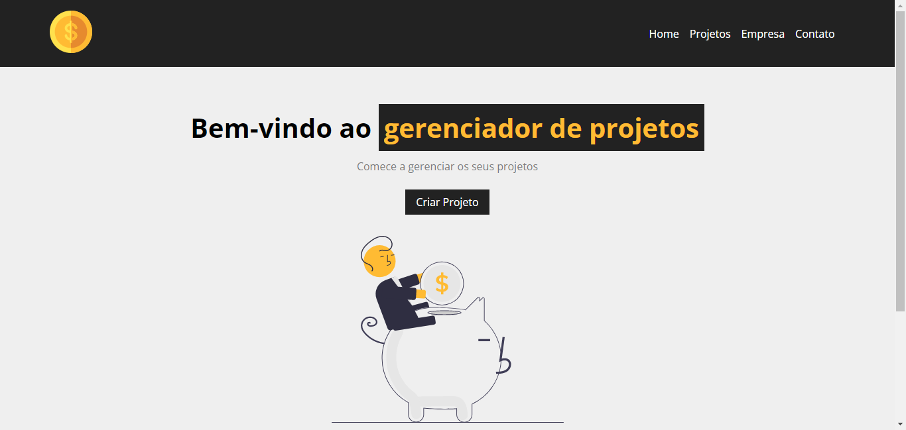
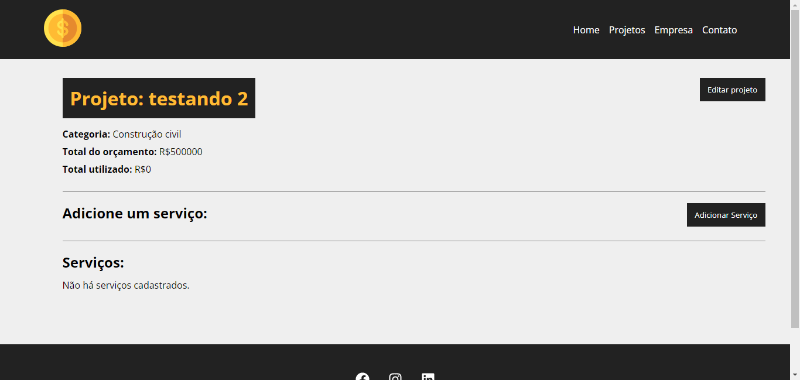
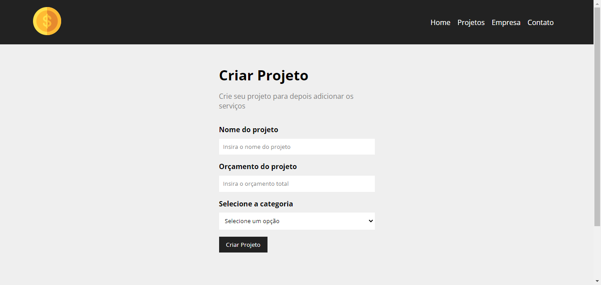
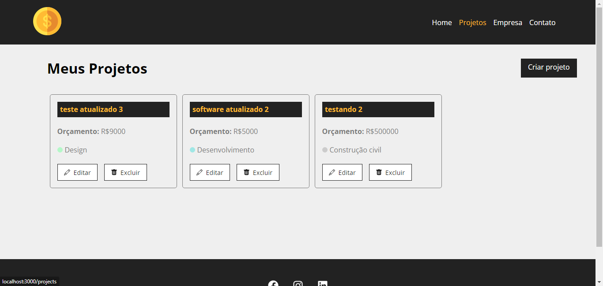

# :computer:  PROJETO 
<h2>Gerenciador_de_Projetos (Costs)</h2>

  <a href="#-tecnologias">Tecnologias</a>&nbsp;&nbsp;&nbsp;|&nbsp;&nbsp;&nbsp;
  <a href="#-projeto">Projeto</a>&nbsp;&nbsp;&nbsp;|&nbsp;&nbsp;&nbsp;
  <a href="#memo-licença">Licença</a>

  

 

## :pencil: Estrutura
Costs - Gerenciador de projetos foi desenvolvido com o framework React

## 🚀 Tecnologias

Esse projeto foi desenvolvido com as seguintes tecnologias:

## 💻 Projeto

sistema de gerencia de projetos para pequenas empresas. Realiza e atualiza orçamentos com base nos valores definidos inicialmente

<h3>Página Home</h3>

---

<h3>Pagina de projetos</h3>

---

<h3>Página de criar projetos</h3>

---

<h3>Página meus projetos<h3>

## :memo: Licença

Esse projeto está sob a licença MIT.

---
